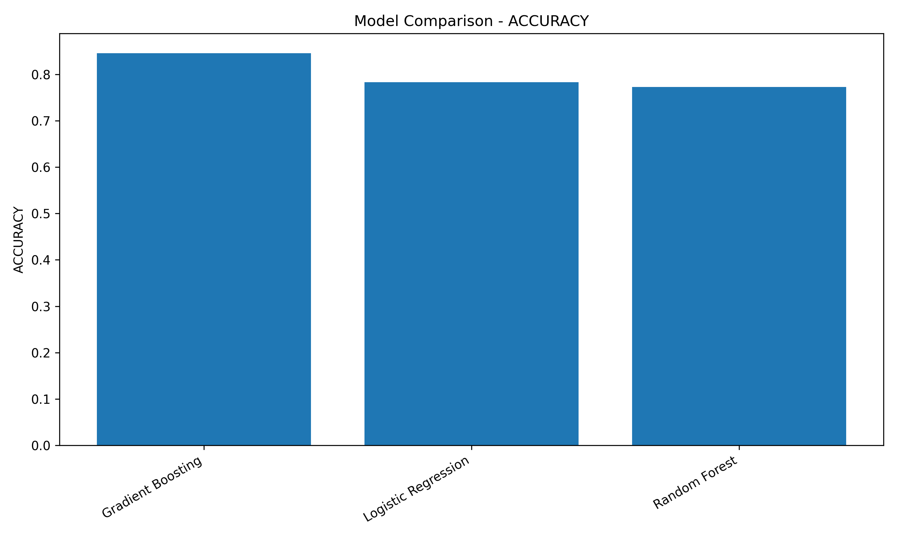
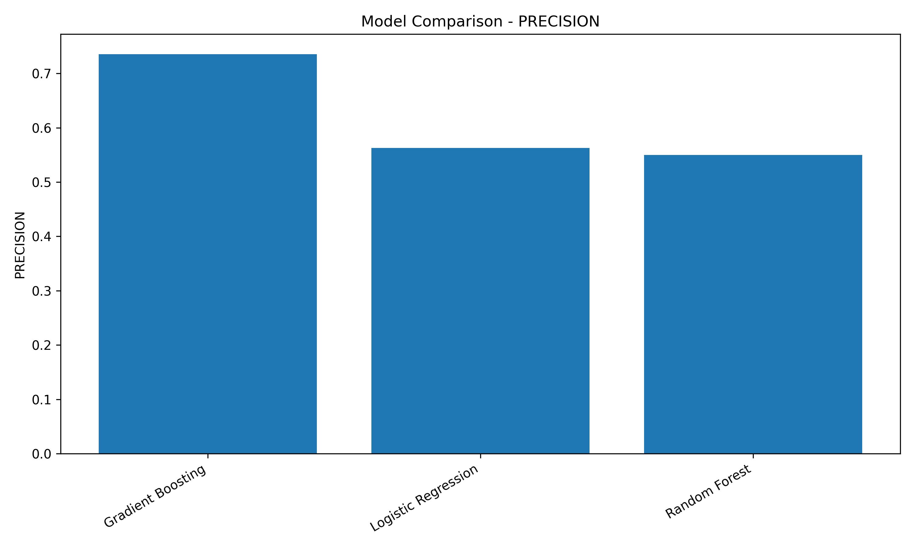
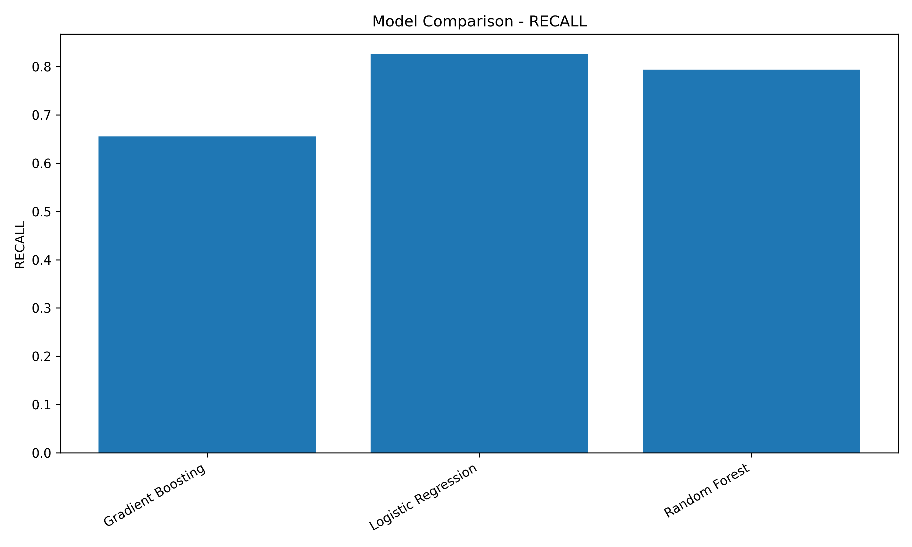
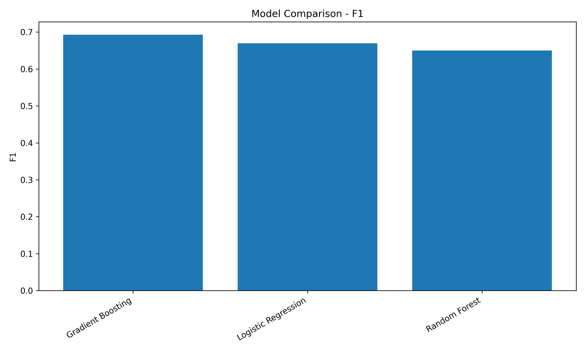

# Customer Churn Prediction

A machine learning project for predicting telecom customer churn using customer demographics, service usage, contract information, billing data, and revenue-related features.

This project is designed as a portfolio-ready data science project. It covers the full workflow from data loading and preprocessing to model training, evaluation, feature importance analysis, visualization, and business interpretation.

---

## Project Overview

Customer churn is one of the most important business problems in telecom and subscription-based companies. Losing existing customers is often more expensive than retaining them, so identifying customers who are likely to churn can help companies design targeted retention strategies.

This project predicts whether a telecom customer is likely to churn using the Maven Analytics Telecom Customer Churn dataset.

The project includes:

- Data loading
- Data preprocessing
- Missing value handling
- Feature engineering
- Binary churn target creation
- Train/test split with stratification
- Logistic Regression baseline
- Random Forest model
- Gradient Boosting model
- Classification metrics
- ROC-AUC comparison
- Feature importance analysis
- Result visualizations
- Business insights

---

## Dataset

The dataset used in this project is the Maven Analytics Telecom Customer Churn dataset.

Raw files used:

```text
data/raw/telecom_customer_churn.csv
data/raw/telecom_zipcode_population.csv
data/raw/telecom_data_dictionary.csv
```

The raw and processed datasets are excluded from GitHub using `.gitignore`.

The main customer churn file contains:

- Customer demographic information
- Location information
- Service subscriptions
- Contract and billing information
- Revenue-related variables
- Customer churn status
- Churn category and churn reason

---

## Project Structure

```text
customer-churn-prediction/
│
├── app/
│   └── streamlit_app.py
│
├── data/
│   ├── raw/
│   └── processed/
│
├── notebooks/
│
├── results/
│   ├── figures/
│   │   ├── churn_distribution.png
│   │   ├── feature_importance_gradient_boosting.png
│   │   ├── model_comparison_accuracy.png
│   │   ├── model_comparison_precision.png
│   │   ├── model_comparison_recall.png
│   │   ├── model_comparison_f1.png
│   │   └── model_comparison_roc_auc.png
│   │
│   ├── feature_importance.csv
│   └── model_results.csv
│
├── src/
│   ├── __init__.py
│   ├── config.py
│   ├── data_loader.py
│   ├── preprocessing.py
│   ├── models.py
│   ├── evaluation.py
│   ├── visualization.py
│   └── utils.py
│
├── .gitignore
├── main.py
├── README.md
└── requirements.txt
```

---

## Methodology

### 1. Data Loading

The project loads three raw CSV files:

- Customer churn data
- Zip code population data
- Data dictionary

The main modeling dataset is `telecom_customer_churn.csv`.

---

### 2. Target Definition

The original target column is:

```text
Customer Status
```

It is converted into a binary churn target:

| Customer Status | Churn |
|---|---:|
| Churned | 1 |
| Stayed | 0 |
| Joined | 0 |

This turns the problem into a binary classification task.

---

### 3. Data Leakage Prevention

The following columns are removed before modeling:

```text
Customer ID
Churn Category
Churn Reason
Customer Status
```

`Churn Category` and `Churn Reason` are removed because they are only known after a customer has already churned. Including them would create data leakage.

---

### 4. Missing Value Handling

Missing values are handled based on business meaning.

For example:

- Missing internet-related service values are treated as `No Internet Service`.
- Missing phone-line related values are treated as `No Phone Service`.
- Missing numeric usage values are filled with `0`.

This preserves business meaning instead of blindly dropping rows.

---

### 5. Model Training

The project trains and compares three classification models:

- Logistic Regression
- Random Forest
- Gradient Boosting

The data is split using stratified train/test split to preserve the churn ratio in both sets.

---

## Dataset Summary

The raw dataset contains:

| Metric | Value |
|---|---:|
| Rows | 7,043 |
| Columns | 38 |

After preprocessing:

| Metric | Value |
|---|---:|
| Rows | 7,043 |
| Features | 32 |
| Target column | Churn |

Target distribution:

| Class | Meaning | Count | Percentage |
|---|---|---:|---:|
| 0 | Not Churned | 5,174 | 73.46% |
| 1 | Churned | 1,869 | 26.54% |

Train/test split:

| Split | Shape |
|---|---:|
| X_train | 5,634 × 32 |
| X_test | 1,409 × 32 |
| y_train | 5,634 |
| y_test | 1,409 |

---

## Evaluation Metrics

The models are evaluated using:

- Accuracy
- Precision
- Recall
- F1-score
- ROC-AUC
- Confusion Matrix
- Classification Report

For churn prediction, **Recall** is especially important because missing a customer who is likely to churn can be costly for the business.

---

## Model Results

| Model | Accuracy | Precision | Recall | F1-score | ROC-AUC |
|---|---:|---:|---:|---:|---:|
| Gradient Boosting | 0.8460 | 0.7357 | 0.6551 | 0.6931 | 0.9115 |
| Logistic Regression | 0.7835 | 0.5628 | 0.8262 | 0.6696 | 0.8918 |
| Random Forest | 0.7729 | 0.5500 | 0.7941 | 0.6499 | 0.8701 |

---

## Best Model

The best overall model based on ROC-AUC is:

```text
Gradient Boosting
```

Final performance:

| Metric | Value |
|---|---:|
| Accuracy | 0.8460 |
| Precision | 0.7357 |
| Recall | 0.6551 |
| F1-score | 0.6931 |
| ROC-AUC | 0.9115 |

Gradient Boosting achieved the best overall ROC-AUC and the strongest balance between precision and recall.

However, Logistic Regression achieved the highest churn recall:

| Model | Churn Recall |
|---|---:|
| Logistic Regression | 0.8262 |
| Random Forest | 0.7941 |
| Gradient Boosting | 0.6551 |

This means Logistic Regression may be more useful when the business goal is to identify as many at-risk customers as possible, even if it creates more false positives.

---

## Confusion Matrix Results

### Logistic Regression

```text
[[795 240]
 [ 65 309]]
```

Logistic Regression correctly detected 309 churned customers and missed 65 churned customers.

---

### Random Forest

```text
[[792 243]
 [ 77 297]]
```

Random Forest correctly detected 297 churned customers and missed 77 churned customers.

---

### Gradient Boosting

```text
[[947  88]
 [129 245]]
```

Gradient Boosting produced fewer false positives and achieved stronger precision, but missed more churned customers than Logistic Regression.

---

## Feature Importance

Feature importance was extracted from the Gradient Boosting model.

Top churn drivers:

| Rank | Feature | Importance |
|---:|---|---:|
| 1 | Contract_Month-to-Month | 0.3504 |
| 2 | Number of Referrals | 0.1233 |
| 3 | Age | 0.0783 |
| 4 | Monthly Charge | 0.0647 |
| 5 | Tenure in Months | 0.0643 |
| 6 | Number of Dependents | 0.0573 |
| 7 | Online Security_No | 0.0431 |
| 8 | Premium Tech Support_No | 0.0349 |
| 9 | Total Revenue | 0.0246 |
| 10 | City_San Diego | 0.0235 |

---

## Business Insights

Based on the model and feature importance analysis, the strongest churn-related patterns are:

### 1. Month-to-month contracts are the strongest churn driver

Customers with month-to-month contracts are much more likely to churn compared with customers on one-year or two-year contracts.

Business recommendation:

- Offer discounts or loyalty benefits for customers who switch to longer-term contracts.
- Target month-to-month customers with retention campaigns.

---

### 2. Referrals are strongly related to customer retention

`Number of Referrals` is one of the most important features. Customers who refer others are likely more engaged and less likely to churn.

Business recommendation:

- Improve referral programs.
- Offer referral-based discounts or loyalty points.
- Monitor customers with zero referrals as a potential risk group.

---

### 3. Monthly charge is an important churn factor

Higher monthly charges may increase churn risk, especially if customers do not perceive enough value from their services.

Business recommendation:

- Identify high-charge customers with low service usage.
- Offer personalized bundles or discounts.
- Improve value communication for premium plans.

---

### 4. Tenure matters

Customer tenure is an important churn predictor. Shorter-tenure customers may not yet be loyal, while long-tenure customers may need loyalty rewards.

Business recommendation:

- Create onboarding campaigns for new customers.
- Create loyalty campaigns for long-term customers.

---

### 5. Missing support/security services increase churn risk

Customers without online security or premium tech support appear more likely to churn.

Business recommendation:

- Offer free trials of online security and premium support.
- Bundle support services with internet plans.
- Target customers without these services for retention offers.

---

## Result Visualizations

### Churn Distribution


### Model Comparison - Accuracy



### Model Comparison - Precision



### Model Comparison - Recall



### Model Comparison - F1-score



### Model Comparison - ROC-AUC


### Feature Importance


---

## How to Run

### 1. Clone the repository

```bash
git clone https://github.com/Zahra-ziaee/customer-churn-prediction.git
cd customer-churn-prediction
```

### 2. Create and activate a virtual environment

Windows PowerShell:

```bash
python -m venv .venv
.venv\Scripts\Activate.ps1
```

### 3. Install dependencies

```bash
pip install -r requirements.txt
```

### 4. Add the dataset

Download the Maven Analytics Telecom Customer Churn dataset and place the files here:

```text
data/raw/telecom_customer_churn.csv
data/raw/telecom_zipcode_population.csv
data/raw/telecom_data_dictionary.csv
```

### 5. Run the project

```bash
python main.py
```

---

## Outputs

Running the project generates:

```text
data/processed/processed_churn_data.csv

results/model_results.csv
results/feature_importance.csv

results/figures/churn_distribution.png
results/figures/model_comparison_accuracy.png
results/figures/model_comparison_precision.png
results/figures/model_comparison_recall.png
results/figures/model_comparison_f1.png
results/figures/model_comparison_roc_auc.png
results/figures/feature_importance_gradient_boosting.png
```

---

## Current Status

Completed:

- Data loading
- Encoding-safe CSV loading
- Missing value handling
- Churn target creation
- Data leakage prevention
- Train/test split
- Logistic Regression baseline
- Random Forest model
- Gradient Boosting model
- Classification metrics
- Confusion matrices
- Model comparison
- Feature importance analysis
- Result visualizations
- GitHub project setup

Planned next steps:

- Add Streamlit dashboard
- Add ROC curve visualization
- Add threshold tuning for business recall
- Add customer risk scoring
- Add downloadable churn-risk customer list
- Add model saving with Joblib
- Add Docker support

---

## Technologies Used

- Python
- NumPy
- Pandas
- Scikit-learn
- Matplotlib
- Git
- GitHub

---

## Author

Zahra Ziaee

 
Focus: Customer Analytics, Churn Prediction, Machine Learning, Classification Models, and Business-Oriented Data Science