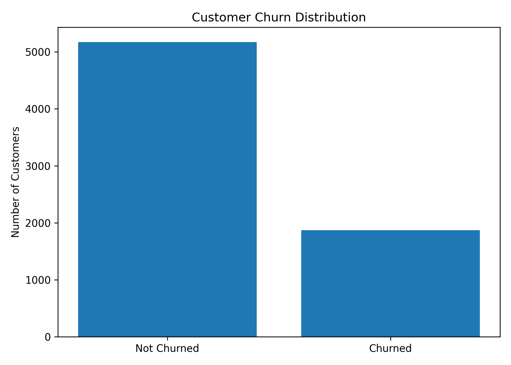
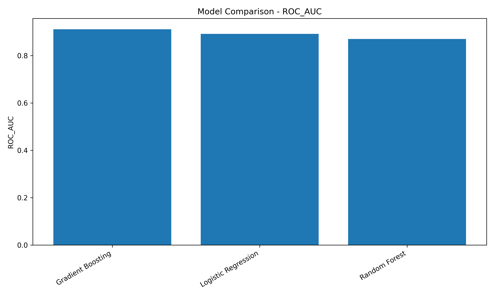
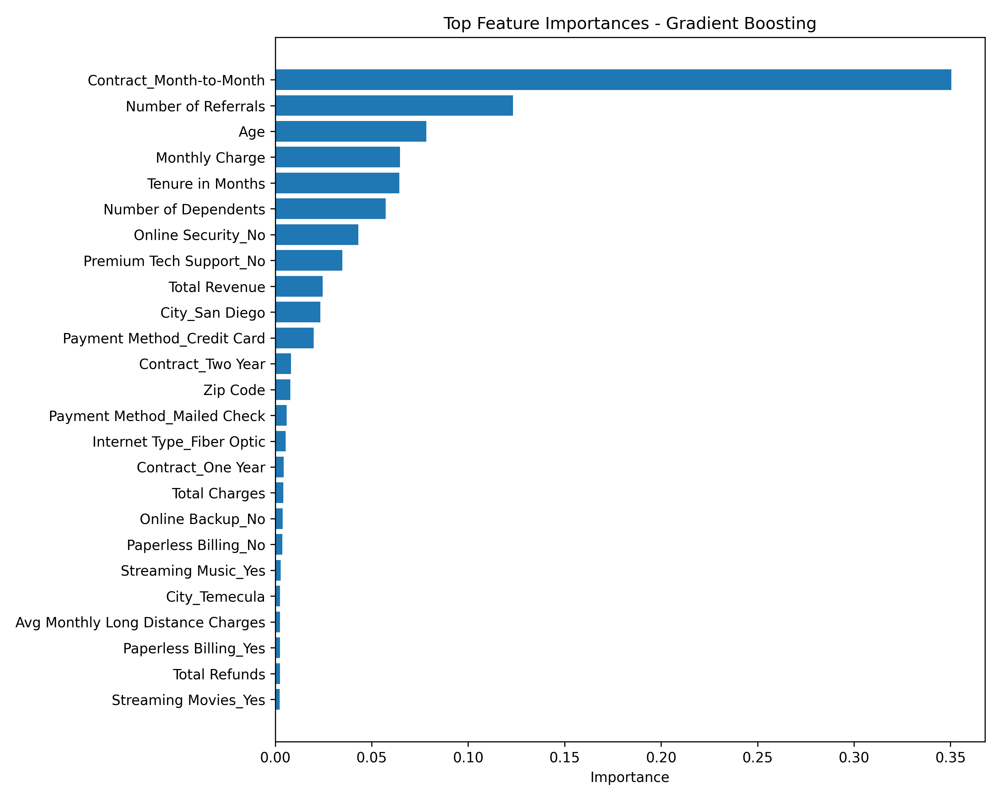
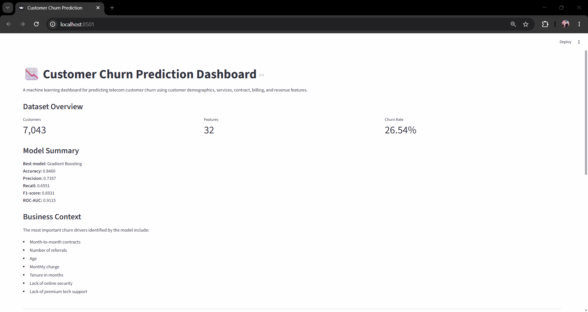
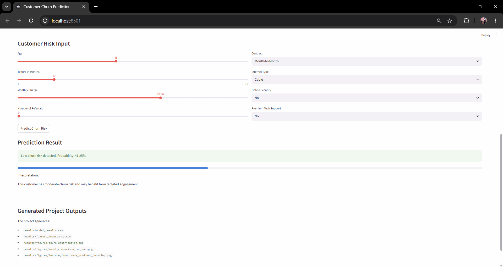

# Customer Churn Prediction

A business-oriented machine learning project for predicting telecom customer churn using customer demographics, service information, contract details, billing behavior, and revenue features.

This project focuses on churn analysis, model comparison, feature importance, business interpretation, and an interactive Streamlit dashboard.

---

## Project Overview

Customer churn prediction helps businesses identify customers who are likely to leave and take proactive retention actions.

This project analyzes telecom customer data and builds machine learning models to predict churn risk.

The project includes:

- Data loading
- Data cleaning
- Missing value handling
- Feature engineering
- Binary churn target creation
- Train/test split
- Logistic Regression baseline
- Random Forest model
- Gradient Boosting model
- Model comparison
- ROC-AUC evaluation
- Feature importance analysis
- Business churn insights
- Streamlit dashboard
- Interactive churn risk prediction demo

This project is focused on **business ML analysis and model interpretation**.

A separate project, `churn-mlops-pipeline`, focuses on MLOps, FastAPI, Docker, testing, and deployment-style structure.

---

## Business Problem

Telecom companies often lose customers due to contract flexibility, pricing, poor service experience, lack of support, or competitive offers.

The goal of this project is to answer:

```text
Which customers are more likely to churn?
Which features are most associated with churn?
Which model performs best?
How can churn prediction support business retention actions?
```

---

## Dataset

The project uses a telecom customer churn dataset.

The dataset includes:

- Customer demographics
- Contract information
- Internet service information
- Online security and support services
- Billing and payment information
- Tenure
- Monthly charges
- Total charges
- Total revenue
- Customer churn status

Dataset overview:

| Metric | Value |
|---|---:|
| Customers | 7,043 |
| Features | 32 |
| Churn Rate | 26.54% |

The raw dataset is excluded from GitHub using `.gitignore`.

Expected raw data location:

```text
data/raw/
```

---

## Target Definition

The original customer status column is converted into a binary churn target.

| Customer Status | Churn |
|---|---:|
| Churned | 1 |
| Stayed | 0 |
| Joined | 0 |

The target variable used for modeling is:

```text
Churn
```

---

## Project Structure

```text
customer-churn-prediction/
│
├── app/
│   └── streamlit_app.py
│
├── data/
│   ├── raw/
│   └── processed/
│
├── results/
│   ├── figures/
│   │   ├── churn_distribution.png
│   │   ├── model_comparison_roc_auc.png
│   │   └── feature_importance_gradient_boosting.png
│   │
│   ├── model_results.csv
│   └── feature_importance.csv
│
├── screenshots/
│   ├── customer_churn_dashboard_overview.png
│   └── customer_churn_prediction_demo.png
│
├── src/
│   ├── __init__.py
│   ├── config.py
│   ├── data_loader.py
│   ├── preprocessing.py
│   ├── train.py
│   ├── evaluation.py
│   ├── visualization.py
│   └── utils.py
│
├── .gitignore
├── main.py
├── README.md
└── requirements.txt
```

---

## Methodology

### 1. Data Loading

The raw telecom churn dataset is loaded using Python and Pandas.

The data loading stage checks:

- Dataset shape
- Column names
- Missing values
- Target distribution
- Basic data quality issues

---

### 2. Data Cleaning

The cleaning process includes:

- Standardizing column names
- Handling missing values
- Removing irrelevant columns
- Converting categorical and numerical variables
- Preparing the churn target column

---

### 3. Feature Engineering

The project uses customer-level features such as:

```text
Age
Tenure in Months
Monthly Charge
Total Charges
Total Revenue
Number of Referrals
Contract
Internet Type
Online Security
Premium Tech Support
Payment Method
```

These features help the model learn customer churn patterns.

---

### 4. Train/Test Split

The dataset is split into training and testing sets.

The split is stratified to preserve the churn distribution in both sets.

---

## Models

The project compares multiple machine learning models:

```text
Logistic Regression
Random Forest
Gradient Boosting
```

The goal is not only to train a model but also to compare model performance and interpret churn drivers.

---

## Best Model

The best-performing model is:

```text
Gradient Boosting
```

Model performance:

| Metric | Value |
|---|---:|
| Accuracy | 0.8460 |
| Precision | 0.7357 |
| Recall | 0.6551 |
| F1-score | 0.6931 |
| ROC-AUC | 0.9115 |

---

## Model Comparison

The project compares models using classification metrics and ROC-AUC.

Model comparison output is saved to:

```text
results/model_results.csv
```

Main evaluation criteria:

- Accuracy
- Precision
- Recall
- F1-score
- ROC-AUC

ROC-AUC is especially useful because churn prediction is a risk-scoring problem, not only a hard classification task.

---

## Feature Importance

The Gradient Boosting model is used to identify important churn drivers.

Important churn drivers include:

- Month-to-month contracts
- Number of referrals
- Age
- Monthly charge
- Tenure in months
- Lack of online security
- Lack of premium tech support

Feature importance output is saved to:

```text
results/feature_importance.csv
```

---

## Business Insights

### 1. Month-to-month contracts increase churn risk

Customers with month-to-month contracts are more flexible and can leave more easily.

Business recommendation:

- Encourage customers to switch to annual or longer-term contracts.
- Offer loyalty discounts for longer contracts.

---

### 2. Low referrals may indicate weak customer engagement

Customers with fewer referrals may have lower satisfaction or weaker brand loyalty.

Business recommendation:

- Create referral incentives.
- Target low-referral customers with engagement campaigns.

---

### 3. Monthly charges are associated with churn

Higher monthly charges can increase churn risk if customers do not perceive enough value.

Business recommendation:

- Review pricing strategy.
- Offer personalized retention discounts to high-risk customers.

---

### 4. Short tenure customers need early retention programs

Customers with shorter tenure may not yet be loyal to the company.

Business recommendation:

- Build onboarding campaigns.
- Monitor new customers during the first months of service.

---

### 5. Lack of online security or premium support can increase churn risk

Customers without support or security services may experience lower perceived service value.

Business recommendation:

- Offer bundled online security and premium support packages.
- Use churn risk scores to target support-based upsell campaigns.

---

## Result Visualizations

### Churn Distribution



### Model Comparison by ROC-AUC



### Feature Importance



---

## Streamlit Dashboard

The project includes a Streamlit dashboard for business-facing churn analysis.

Run the dashboard:

```bash
streamlit run app/streamlit_app.py
```

The dashboard includes:

- Dataset overview
- Customer count
- Feature count
- Churn rate
- Best model summary
- Business context
- Interactive customer risk input
- Churn probability prediction
- Prediction interpretation
- Generated project outputs

---

## Dashboard Preview

### Customer Churn Dashboard Overview



### Customer Churn Prediction Demo



---

## How to Run

### 1. Clone the repository

```bash
git clone https://github.com/Zahra-ziaee/customer-churn-prediction.git
cd customer-churn-prediction
```

### 2. Create and activate virtual environment

Windows PowerShell:

```bash
python -m venv .venv
.venv\Scripts\Activate.ps1
```

### 3. Install dependencies

```bash
pip install -r requirements.txt
```

### 4. Add dataset

Place the raw telecom churn dataset in:

```text
data/raw/
```

### 5. Run the machine learning pipeline

```bash
python main.py
```

### 6. Run the Streamlit dashboard

```bash
streamlit run app/streamlit_app.py
```

---

## Outputs

Running the project generates:

```text
data/processed/processed_churn_data.csv

results/model_results.csv
results/feature_importance.csv

results/figures/churn_distribution.png
results/figures/model_comparison_roc_auc.png
results/figures/feature_importance_gradient_boosting.png

screenshots/customer_churn_dashboard_overview.png
screenshots/customer_churn_prediction_demo.png
```

---

## Difference from Churn MLOps Pipeline

This repository focuses on:

```text
Business ML analysis
Model comparison
Feature importance
Churn drivers
Business recommendations
Streamlit dashboard
```

The separate `churn-mlops-pipeline` repository focuses on:

```text
MLOps-style structure
Saved model artifact
FastAPI prediction service
Swagger documentation
Docker
Pytest
Deployment-oriented workflow
```

This separation helps keep the portfolio clear:

```text
customer-churn-prediction = analytical machine learning project
churn-mlops-pipeline = production-style MLOps project
```

---

## Current Status

Completed:

- Data loading
- Data cleaning
- Feature engineering
- Binary churn target creation
- Train/test split
- Logistic Regression baseline
- Random Forest model
- Gradient Boosting model
- Model comparison
- ROC-AUC evaluation
- Feature importance analysis
- Business insight generation
- Streamlit dashboard
- Dashboard screenshots
- GitHub-ready structure

Planned next steps:

- Add SHAP-based explainability
- Add customer segment-level churn analysis
- Add confusion matrix visualization
- Add threshold tuning analysis
- Add more business retention scenarios
- Add automated tests

---

## Technologies Used

- Python
- Pandas
- NumPy
- Scikit-learn
- Matplotlib
- Streamlit
- Machine Learning
- Classification
- Feature Importance
- Business Analytics
- Git
- GitHub

---

## Resume Summary

```text
Customer Churn Prediction | Python, Scikit-learn, Streamlit, Business Analytics

- Built a telecom customer churn prediction project using Logistic Regression, Random Forest, and Gradient Boosting.
- Compared classification models using accuracy, precision, recall, F1-score, and ROC-AUC.
- Achieved 0.911 ROC-AUC with a Gradient Boosting model and identified key churn drivers using feature importance.
- Created business recommendations for customer retention based on contract type, monthly charges, tenure, referrals, and service features.
- Built a Streamlit dashboard for model summary, churn risk prediction, and business interpretation.
```

---

## Author

Zahra Ziaee
 
Focus: Machine Learning, Customer Analytics, Business Intelligence, Churn Modeling, and Data-Driven Decision Making